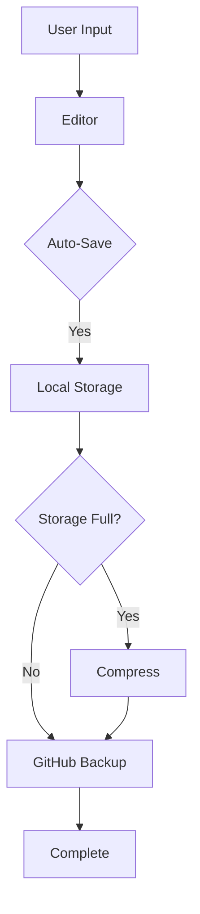

# .NB Architecture Overview

## 1. Core Architecture

### 1.1 Storage Architecture
```typescript
interface StorageStrategy {
  local: {
    primary: 'indexedDB';
    compression: boolean;
    backupFrequency: number;
  };
  github: {
    enabled: boolean;
    autoSync: boolean;
    privateRepo: boolean;
  };
}

const STORAGE_STRATEGY: StorageStrategy = {
  local: {
    primary: 'indexedDB',
    compression: true,
    backupFrequency: 300000 // 5 minutes
  },
  github: {
    enabled: true,
    autoSync: true,
    privateRepo: true
  }
};
```

### 1.2 Package-based Architecture
```typescript
interface PackageConfig {
  core: {
    name: string;
    version: string;
    required: true;
  };
  features: {
    name: string;
    version: string;
    required: false;
    dependencies?: string[];
  }[];
}

const PACKAGE_CONFIG: PackageConfig = {
  core: {
    name: '@dot-nb/core',
    version: '1.0.0',
    required: true
  },
  features: [
    {
      name: '@dot-nb/todo',
      version: '1.0.0',
      required: false
    },
    {
      name: '@dot-nb/canvas',
      version: '1.0.0',
      required: false
    }
  ]
};
```

## 2. User Types

### 2.1 User Personas
```typescript
type UserType = 'professional' | 'student' | 'programmer' | 'writer';

interface UserFeatures {
  maxDocuments: number;
  attachmentTypes: string[];
  githubIntegration: boolean;
  premium: boolean;
}

const USER_FEATURES: Record<UserType, UserFeatures> = {
  professional: {
    maxDocuments: Infinity,
    attachmentTypes: ['*'],
    githubIntegration: true,
    premium: true
  },
  student: {
    maxDocuments: 3,
    attachmentTypes: ['image/*', 'application/pdf'],
    githubIntegration: true,
    premium: false
  },
  programmer: {
    maxDocuments: Infinity,
    attachmentTypes: ['*'],
    githubIntegration: true,
    premium: true
  },
  writer: {
    maxDocuments: Infinity,
    attachmentTypes: ['image/*', 'application/pdf'],
    githubIntegration: true,
    premium: true
  }
};
```

## 3. Data Flow

### 3.1 Document Flow


### 3.2 Storage Flow
```typescript
class StorageFlow {
  async saveDocument(document: Document): Promise<void> {
    // 1. Save to IndexedDB
    await this.saveToLocal(document);

    // 2. Check storage quota
    const quotaExceeded = await this.checkQuota();
    if (quotaExceeded) {
      await this.handleQuotaExceeded();
    }

    // 3. Backup to GitHub if enabled
    if (this.isGitHubEnabled()) {
      await this.backupToGithub(document);
    }
  }

  private async handleQuotaExceeded(): Promise<void> {
    // 1. Compress existing data
    await this.compressOldDocuments();

    // 2. If still exceeded, prompt for export
    if (await this.checkQuota()) {
      await this.promptForExport();
    }
  }
}
```

## 4. Feature Architecture

### 4.1 Core Features
- Notebook Management
- Document Editing
- Storage & Backup
- Import/Export

### 4.2 Extension Features (Future)
- Todo Lists (separate package)
- Canvas (separate package)
- Floating Notes (separate package)

Each feature will be developed and distributed as a separate package, allowing users to install only the features they need.